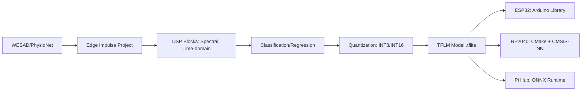

# SYNAPSE Edge AI Pipeline Skill

This skill manages the complete edge AI workflow from dataset → Edge Impulse → TFLM → MCU deployment, implementing Architecture.md §45-53: **Edge Triage** (always-on, sub-mW) and **Fusion/Personalization** (hub, higher power).

## Model Categories

### Tier 0 Edge Triage (Always-On, Sub-mW)
**Target**: ESP32 (in-ear pod) or RP2040 (ultra-low-power)
**Model**: TinyML transformer or SNN (spiking neural network)
**Inputs**: PPG (64Hz), IMU (100Hz), Temp (1Hz), 1-2ch EEG (250Hz)
**Outputs**: Sleep onset detection, HRV anomaly, immobility, motion artifact flag
**Constraints**: <50KB RAM, <200KB Flash, <1mW average inference

### Tier 1 Fusion (Hub, Batch)
**Target**: Raspberry Pi 5 (hub) or ESP32-S3 (if hub on forearm)
**Model**: Multimodal transformer (ECG+PPG+EEG+fNIRS+IMU+Temp)
**Inputs**: All Tier 0 + Tier 1 streams synchronized
**Outputs**: Sleep stages, cognitive load, autonomic stress, cardio-cerebral coherence
**Constraints**: <5MB RAM, <10MB model, batch inference acceptable

### Personalization Layer (Federated/On-Device)
**Target**: Hub + optional cloud sync
**Method**: Adapter layers / LoRA on base fusion model
**Data**: User-specific baselines, calibration sessions (Tier 2)
**Privacy**: On-device only in Phase 0-2; federated optional later

## Edge Impulse → TFLM Pipeline



### Project Structure
```
edge-impulse/
├── projects/
│   ├── tier0-triage/          # Sleep onset, HRV anomaly, immobility
│   │   ├── impulse.json
│   │   ├── dsp-config.json
│   │   └── model-versions/
│   │       ├── v0.1.0/        # Initial baseline
│   │       └── v0.2.0/        # Improved with WESAD augmentation
│   └── tier1-fusion/          # Sleep staging, stress, cognitive load
│       ├── impulse.json
│       └── model-versions/
└── deployment/
    ├── esp32/
    │   ├── tier0-triage/      # Arduino library + example
    │   └── tier1-fusion/      # If hub is ESP32-S3
    ├── rp2040/
    │   └── tier0-triage/      # CMake + pico-sdk
    └── pi-hub/
        └── tier1-fusion/      # ONNX Runtime + Python wrapper
```

## Quantization Strategy

### Tier 0 (INT8 Mandatory)
```python
# Edge Impulse EON Compiler settings
quantization = {
    "scheme": "int8",
    "representative_dataset": "wesad_tier0_representative.npy",
    "input_dtype": "int8",
    "output_dtype": "int8",
    "fallback_to_float": False,  # Hard requirement for sub-mW
}
```

### Tier 1 (INT16 or Float16)
```python
quantization = {
    "scheme": "int16",  # Better accuracy for fusion
    "representative_dataset": "multimodal_representative.npy",
    "input_dtype": "int16",
    "output_dtype": "float32",  # Softmax/logits need precision
}
```

## Model Versioning & CI/CD

### Version Format: `MAJOR.MINOR.PATCH-TIER-TARGET`
- `v0.1.0-t0-esp32` — Tier 0, ESP32 target
- `v0.2.0-t1-pi5` — Tier 1, Pi 5 hub target
- `v1.0.0-t0-rp2040` — Tier 0, RP2040 target (GA)

### GitHub Actions Integration
```yaml
# .github/workflows/edge-ai.yml
jobs:
  train-and-quantize:
    runs-on: ubuntu-latest
    steps:
      - uses: actions/checkout@v4
      - name: Train on Edge Impulse
        run: |
          edge-impulse-cli --api-key ${{ secrets.EI_API_KEY }} \
            --project tier0-triage \
            --train --quantize int8
      - name: Download TFLite
        run: |
          edge-impulse-cli --download-model \
            --output deployment/esp32/tier0-triage/model.tflite
      - name: Validate on Target
        run: |
          python scripts/validate_tflm.py \
            --model deployment/esp32/tier0-triage/model.tflite \
            --target esp32 \
            --test-data data/processed/test_tier0.npz
      - name: Upload Artifact
        uses: actions/upload-artifact@v4
        with:
          name: tier0-triage-${{ github.sha }}
          path: deployment/
```

## TFLM Validation on Target

```python
# scripts/validate_tflm.py
import tflite_runtime.interpreter as tflite
import numpy as np


def validate_tflm(model_path, target, test_data):
    interpreter = tflite.Interpreter(model_path=model_path)
    interpreter.allocate_tensors()

    input_details = interpreter.get_input_details()
    output_details = interpreter.get_output_details()

    # Run inference
    latencies = []
    predictions = []

    for sample in test_data:
        interpreter.set_tensor(input_details[0]["index"], sample)

        start = time.perf_counter()
        interpreter.invoke()
        latencies.append(time.perf_counter() - start)

        pred = interpreter.get_tensor(output_details[0]["index"])
        predictions.append(pred)

    return {
        "avg_latency_ms": np.mean(latencies) * 1000,
        "p99_latency_ms": np.percentile(latencies, 99) * 1000,
        "ram_usage_kb": get_ram_usage(),  # Platform-specific
        "accuracy": compute_accuracy(predictions, test_labels),
    }
```

## Quality Gates

- [ ] Tier 0 model: <50KB RAM, <200KB Flash, <5ms inference on ESP32
- [ ] Tier 0 accuracy: ≥90% sleep onset F1, ≤5% false positive rate
- [ ] Tier 1 model: <5MB RAM, <200ms inference on Pi 5
- [ ] Tier 1 accuracy: Sleep staging ≥80% (vs PSG), Stress ≥85% (vs WESAD)
- [ ] Quantization: INT8 accuracy drop <2% vs float32 baseline
- [ ] Model version tagged in git + Edge Impulse project
- [ ] TFLM artifact uploaded to GitHub Releases

## References
- Architecture.md §45-53 (Edge triage + Fusion)
- Roadmap.md §123-127 (Edge AI stack), §132-133 (deployment loop)
- Edge Impulse: https://docs.edgeimpulse.com/
- TFLM: https://www.tensorflow.org/lite/microcontrollers
- BioGAP-Ultra: Benini et al. 2025 (modular edge-AI for EEG+EMG+ECG+PPG)